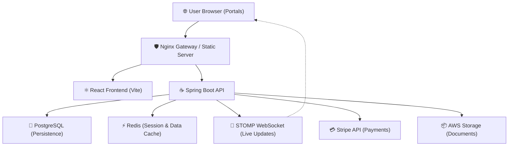
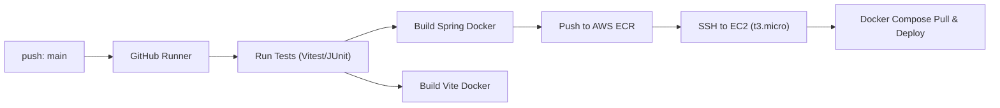

# 📚 Bookfair Stall Reservation System

A high-performance, real-time ecosystem designed to manage the end-to-end lifecycle of large-scale event stall allocations. This platform transforms a manual reservation process into an automated, data-driven "Revenue Optimization" tool for event organizers.

---

## 🏗️ System Architecture

The platform uses a decoupled, containerized architecture optimized for cloud-native deployment.



### 🛰️ Real-Time Logic
All map interactions (reservations, cancels, admin locks) are reflected **sub-100ms** across all connected clients via a dedicated **STOMP Broker**. This eliminates the need for polling and prevents double-booking disputes.

---

## 🏛️ Domain Architecture

The platform follows a hierarchical approach to spatial management:

| Entity | Role | Key Attribute |
| :--- | :--- | :--- |
| **Venue** | Global physical location | Address, timezone |
| **Hall** | Specific room/area | Floor plan, height, utilities |
| **Stall Template** | Blueprint for a physical spot | Base Rate, Size (S/M/L) |
| **Event Stall** | A "Live" instance of a template | **Final Price (Calculated)**, Multiplier |
| **Reservation** | Legal & Financial binding | Status (PAID/PENDING), QR Code |

---

## 🛳️ Deployment & CI/CD (The Production Roadmap)

The system is deployed on **AWS** using a highly cost-efficient `t3.micro` footprint.

### CI/CD Pipeline (GitHub Actions)


### Infrastructure Specs
- **Compute**: AWS EC2 `t3.micro` (2 vCPU, 1 GiB RAM).
- **Network**: DuckDNS/Route53 for dynamic IP resolution + Nginx for SSL termination.
- **Monitoring**: Spring Boot Actuator + `SystemHealth.tsx` dashboard for real-time uptime checks.

---

## 📁 Project Structure walkthrough

```text
reservation_system/
├── .github/workflows/          # Automated deployment workflows
├── backend/                    # Java 21 Performance API
│   ├── config/                 # Redis, Security, WebSocket, and Thread-pool config
│   ├── controller/             # Resource-oriented REST Endpoints
│   ├── features/               # Modular business logic (Refunds, Reservations)
│   ├── service/                # Heuristics (Pricing Engine, QR Generation)
│   └── repository/             # Optimized queries (Join Fetch, Custom Projections)
├── frontend/                   # React 18 / TypeScript 5
│   ├── src/apps/               # Role-Specific Applications (Admin, Vendor, etc.)
│   ├── src/shared/api/         # Centralized TanStack Query API wrappers
│   ├── src/shared/components/  # Atomic Design (Buttons, Modals, Map Canvas)
│   └── src/hooks/              # STOMP/SockJS synchronization hooks
└── infrastructure/             # Docker, Nginx, and DB configuration
```

---

## 🧩 Advanced Features Mentioned
- **TanStack Query Integrations**: Used for all asynchronous data fetching with automatic cache invalidation on successful mutations.
- **Atomic Locking**: Uses PostgreSQL `SELECT FOR UPDATE` to ensure data integrity during concurrent booking bursts.
- **Dynamic Pricing**: A complex heuristic that considers proximity to influences, stall geometry, and edge distances.
