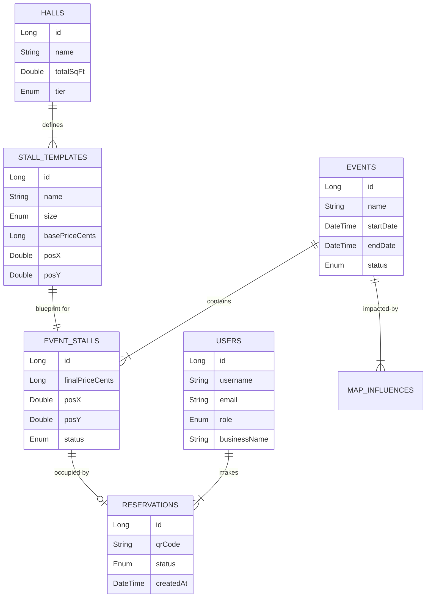
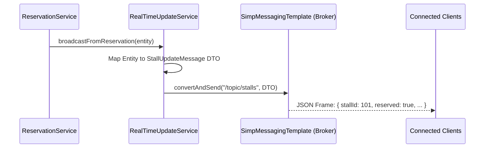
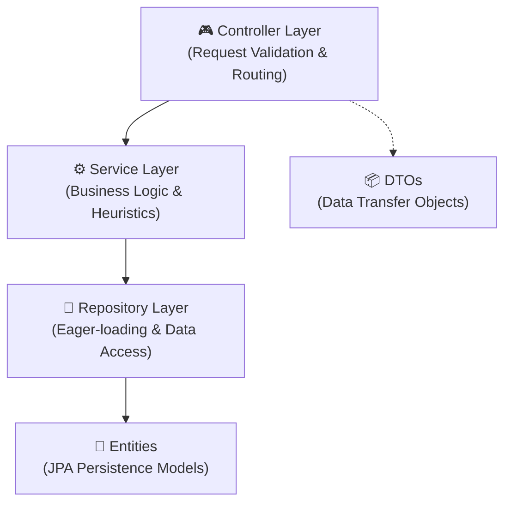

# 📐 Technical Architecture Deep Dive


---

## 1. Data Integrity & Concurrency

When thousands of users view the same stall map, the system must handle race conditions during selection.

### Atomic Locking Pattern
In `ReservationService.java`, the system utilizes database-level row locking:
1.  **Transactional Scope**: Methods are marked with `@Transactional`.
2.  **Row Locking**: `eventStallRepository.findByIdWithLock(id)` issues a `SELECT ... FOR UPDATE` query.
3.  **Result**: This forces other concurrent requests for the same stall to wait, preventing "ghost reservations" or double-booking.

### Performance Optimization
To avoid the **N+1 Problem**, `ReservationRepository.java` utilizes `JOIN FETCH` queries:
```java
@Query("SELECT r FROM Reservation r LEFT JOIN FETCH r.eventStall es ... WHERE r.user.id = :id")
```
This reduces dozens of database round-trips into a single, efficient joined query.

---

## 2. Pricing Heuristic (Visibility Engine)

The system calculates a **Visibility Score** that dictates the final price of every stall. This is achieved through a multi-factor heuristic implemented in `PricingService.java`.

### 🧮 Granular Mathematical Breakdown

#### 1. Coordinate Normalization & Centroids
All coordinates are handled in a normalized percentage space ($0$ to $100$). For a stall $S$ with top-left coordinates $(x, y)$ and dimensions $(w, h)$, the centroid $(x_c, y_c)$ is:
$$x_c = x + \frac{w}{2}, \quad y_c = y + \frac{h}{2}$$

#### 2. Spatial Influence Contribution
The system iterates through all active **Map Influences** $I$. For each influence with intensity $I_i$, position $(I_x, I_y)$, and radius $I_r$, the distance $d$ is:
$$d = \sqrt{(x_c - I_x)^2 + (y_c - I_y)^2}$$

If $d < I_r$, the contribution $C$ to the visibility score is:
$$C = I_i \times \left(1 - \frac{d}{I_r}\right)^n$$
- For **Linear Falloff**: $n = 1$
- For **Exponential Falloff**: $n = 2$

#### 3. Edge Proximity Penalty
To discourage "crowded" edge placements and optimize floor flow, a penalty $P_{edge}$ is applied if any part of the stall is within the 2% boundary:
$$P_{edge} = \begin{cases} 5, & \text{if } x \le 2 \text{ or } y \le 2 \text{ or } (x+w) \ge 98 \text{ or } (y+h) \ge 98 \\ 0, & \text{otherwise} \end{cases}$$

#### 4. Final Visibility Score calculation
The total score $S_{total}$ is aggregated from the baseline $S_{base}$ (template-defined) and all spatial modifiers, then clamped:
$$S_{total} = \text{clamp}\left(5, S_{base} + \sum C - P_{edge}, 100\right)$$

#### 5. Non-Linear Area Scaling
Stall pricing scales with surface area but is clamped to prevent extreme outliers. The size factor $F_{size}$ is calculated relative to a standard 8% x 8% reference stall ($Area_{ref} = 64$):
$$Area = w \times h$$
$$F_{size} = \text{clamp}\left(0.5, \frac{Area}{64}, 2.5\right)$$

#### 6. Final Monetary Calculation
The final price in cents $P_{final}$ is derived by combining the visibility factor and the size factor against the base rate $P_{base}$ and an optional manual multiplier $M$:
$$P_{final} = P_{base} \times \left(1 + \frac{S_{total} - 50}{100}\right) \times F_{size} \times M$$

---

## 3. Frontend State Management (TanStack Query)

The frontend architecture relies on **TanStack Query v5** for robust server-state management.

### Query Invalidation Cycle
When an action is performed (e.g., manual payment confirmation), the system uses an invalidation trigger:
```typescript
// useAdminReservations.ts
const mutation = useMutation({
    mutationFn: adminApi.confirmPayment,
    onSuccess: () => {
        // Automatically syncs all active dashboards
        queryClient.invalidateQueries({ queryKey: ['admin-reservations'] });
        queryClient.invalidateQueries({ queryKey: ['admin-stats'] });
    }
});
```

### Global API Envelope
All responses are wrapped in a standard `ResultEnvelope`, providing consistent error handling across the app.

---

## 4. Real-Time Sync (STOMP/SockJS)

The "Live Map" is achieved via a dedicated STOMP broker.

- **Broker**: Configured in `WebSocketConfig.java` to handle `/topic/stalls`.
- **Fallbacks**: `SockJS` is used to ensure connectivity even behind restrictive corporate firewalls.
- **Broadcasting**: `RealTimeUpdateService.java` pushes JSON payloads instantly when a reservation lifecycle event occurs (Selection -> Payment -> Confirmation).

---

## 5. Security Architecture

### Role-Based Authorization
Security is enforced by a **Tiered Filter Chain**:
1.  **RateLimit Layer**: `Bucket4j` intercepts excessive requests.
2.  **JWT Layer**: Validates identity and extracts roles.
3.  **Method Security**: `@PreAuthorize` used on sensitive service methods.

### Roles Hierarchy:
- `ADMIN`: Infrastructure control, designer access, financial management.
- `EMPLOYEE`: Entry scanning, check-in validation, manual overrides.
- `VENDOR`: Self-service booking, document management, profile updates.
- `ANONYMOUS`: Registration, public event discovery, live map viewing.

---

## 6. Database Schema & Data Modeling

The system uses a highly structured relational schema to manage the complex interplay between physical venues, temporal events, and financial transactions.

### Entity-Relationship Diagram (Detailed)



### Architectural Pattern: Template vs. Instance
A critical design decision in this schema is the separation of **Stall Templates** and **Event Stalls**:

1.  **Stall Templates**: Reside in a `Hall`. They define the *physical* properties (Name, Size, Default Position) that rarely change.
2.  **Event Stalls**: These are "Snapshots" created when an Event is scheduled. They inherit properties from the template but allow for **Event-Specific Pricing** and **Dynamic Multipliers** without altering the master hall layout.

### Data Integrity Measures
- **Unique Constraints**: `event_stalls` has a unique constraint on `(event_id, template_id)` to prevent duplicate allocations.
- **Audit Logging**: Every administrative action (Price changes, Refunds) is captured in the database with a timestamp and user ID.
- **Soft Deletion**: Most major entities use a `deletedAt` column for logical deletion, preserving historical reservation data for financial auditing.

---

## 7. Real-Time Infrastructure (WebSockets)

The system utilizes **STOMP (Simple Text Oriented Messaging Protocol)** over **SockJS** to provide sub-100ms state updates to all connected clients.

### Transmission Flow
When a stall state changes (e.g., booked by another user), the following sequence occurs:



- **Broker**: Configured in `WebSocketConfig.java` using an in-memory messenger.
- **Compatibility**: SockJS enables fallback to Long Polling if WebSockets are blocked by corporate proxies.

---

## 8. Ticketing & Automated Communication

The platform automates the ticketing lifecycle through a dedicated generation pipeline.

### QR Code Engineering (`QrService.java`)
- **Library**: ZXing (Zebra Crossing).
- **Configuration**: 200x200 pixel PNG output.
- **Payload**: Encodes a unique UUID-based `qr_code` string which acts as the retrieval key for the Employee Scanner application.

### Email Confirmation Flow (`EmailService.java`)
Confirmation emails are sent asynchronously following successful payment.
1.  **Template Engine**: Thymeleaf processes `res_confirmation_email_template.html`.
2.  **Inline Resources**: Unlike standard attachments, the QR code is embedded as an **Inline Mime Resource** via `MimeMessageHelper.addInline("qrCode", bytes)`.
3.  **Security**: Generates a JWT-backed **Download URL** for high-resolution ticket PDFs, ensuring only the owner can access the raw image file.

---

## 9. Document & Notification Systems

### Document Storage (`DocumentService.java`)
- **Collision Prevention**: Files are saved using a derived UUID name: `UPLOAD_DIR/${UUID}_${OriginalName}`.
- **Metadata Separation**: Binary files are stored on the local filesystem (or S3 in production), while metadata (Type, Size, Uploader) is indexed in PostgreSQL.
- **Access Control**: Validates that only the `ADMIN` or the specific `UPLOADER` can retrieve a document's byte stream.

### Push Notifications (`NotificationService.java`)
- **Persistence**: Notifications are stored in the database to ensure "read/unread" status persists across logins.
- **Trigger Points**: Automatically creates entries for:
    - Successful Payments.
    - Stall Cancellation confirmations.
    - Administrative approval of vendor documents.

---

## 10. MVC Architectural Integrity

The backend follows a strict **Controller-Service-Repository** boundary system to isolate complexity.

### Layer Responsibilities
| Layer | Duty | Tools Used |
| :--- | :--- | :--- |
| **Controller** | Request Validation, HTTP Headers, DTO Mapping | `@RestController`, `@Valid`, `ResultEnvelope` |
| **Service** | Heuristics (Pricing), Transaction Boundaries, Logic | `@Service`, `@Transactional`, Heuristic Engines |
| **Repository** | Optimized Data Access, Eager Fetching | `@Repository`, `@Query`, `JOIN FETCH` |
| **Entity** | Real-world domain mapping, DB schema | `@Entity`, JPA, Hibernate |

### Global Exception Strategy
The system uses a `GlobalExceptionHandler` to catch all internal exceptions and re-map them to a standardized JSON response:
```json
{
  "success": false,
  "message": "User-friendly error message",
  "data": null,
  "status": 400
}
```
This ensures the React frontend never encounters raw Java stack traces and can always parse a consistent response object.

---

## 7. Real-Time Infrastructure (WebSockets)

The system utilizes **STOMP (Simple Text Oriented Messaging Protocol)** over **SockJS** to provide sub-100ms state updates to all connected clients.

### WebSocket Configuration (`WebSocketConfig.java`)
- **Message Broker**: A simple in-memory broker is enabled on the `/topic` prefix.
- **Application Prefix**: Clients send messages to the server using the `/app` prefix.
- **Endpoint**: The main connection point is `/ws`, which supports SockJS fallbacks for browsers with restricted WebSocket support.

### Broadcasting Flow
When a stall's state changes (e.g., a user clicks to reserve), the `RealTimeUpdateService` is triggered:
1.  **Logic**: `broadcastStallUpdate(stallId, reserved, occupiedBy, category)`
2.  **Payload**: A `StallUpdateMessage` DTO is serialized to JSON.
3.  **Transmission**: The `SimpMessagingTemplate` pushes the frame to `/topic/stalls`.

---

## 8. QR Code & Email Automation

The platform automates the ticketing process using a "Generate-to-Attach" pipeline.

### QR Generation (`QrService.java`)
- **Engine**: Uses the **ZXing (Zebra Crossing)** library.
- **Format**: Generates 200x200 pixel PNG images.
- **Payload**: Encodes the unique `qr_code` string from the reservation record, which acts as the primary key for the Employee Scanner app.

### Email Delivery Flow (`EmailService.java`)
1.  **Templating**: Uses **Thymeleaf** to process `res_confirmation_email_template.html`.
2.  **Dynamic Context**: Injects the `Reservation` object, User details, and a unique **Secure Download URL** (JWT-backed).
3.  **Inline Attachments**: The generated QR code is not sent as a standard attachment but added as an **Inline Mime Resource** via `MimeMessageHelper.addInline("qrCode", ...)`. This ensures the QR displays directly within the body of the email on all modern clients.

---

## 9. The MVC & Service Layer Pattern

The backend follows a strict **Controller-Service-Repository** architectural pattern to ensure separation of concerns.



### Key Components:
- **Controllers**: Handle HTTP mapping and use `@Valid` for request body validation. They return `ResponseEntity<ResultEnvelope<T>>`.
- **Services**: Where the "Heavy Lifting" happens. Services are the only place where `@Transactional` is managed, ensuring ACID compliance across multiple repository calls.
- **Repositories**: Extend `JpaRepository` and use custom `@Query` with `JOIN FETCH` to prevent N+1 performance issues.
- **DTOs**: Ensure that internal database structures (Entities) are never leaked directly to the client, preventing over-exposure of sensitive data.
